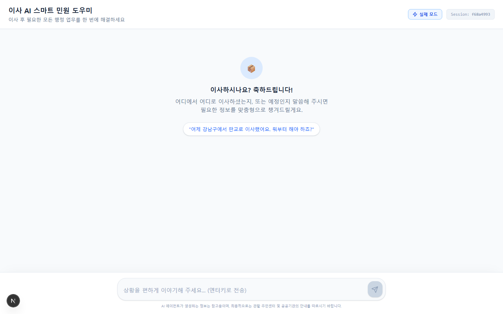
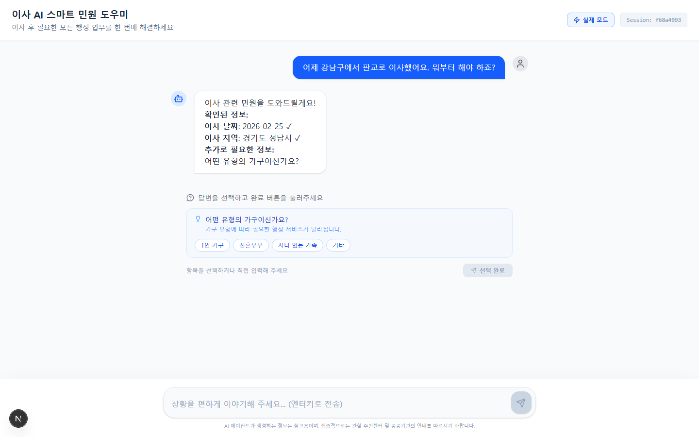
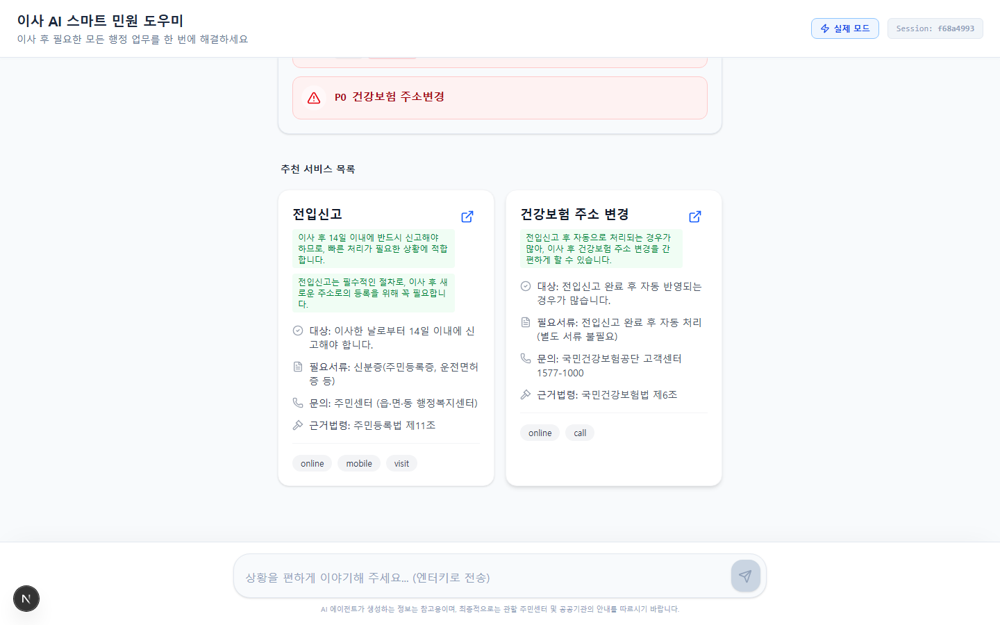
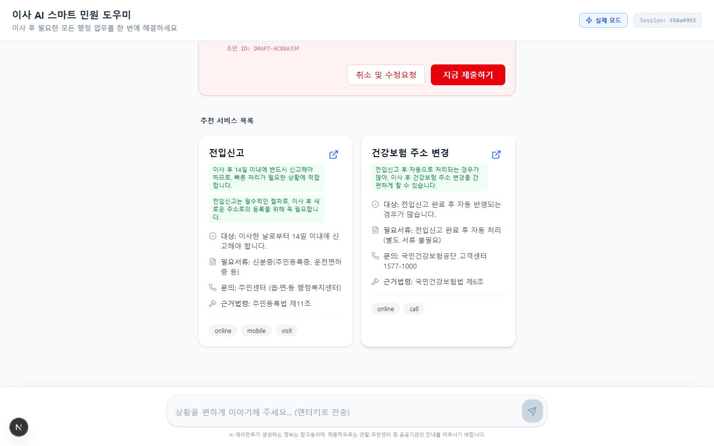
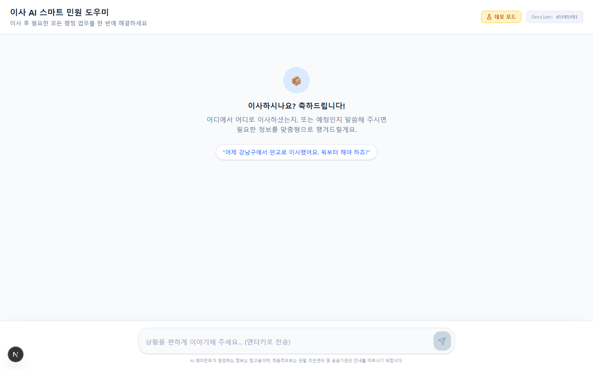
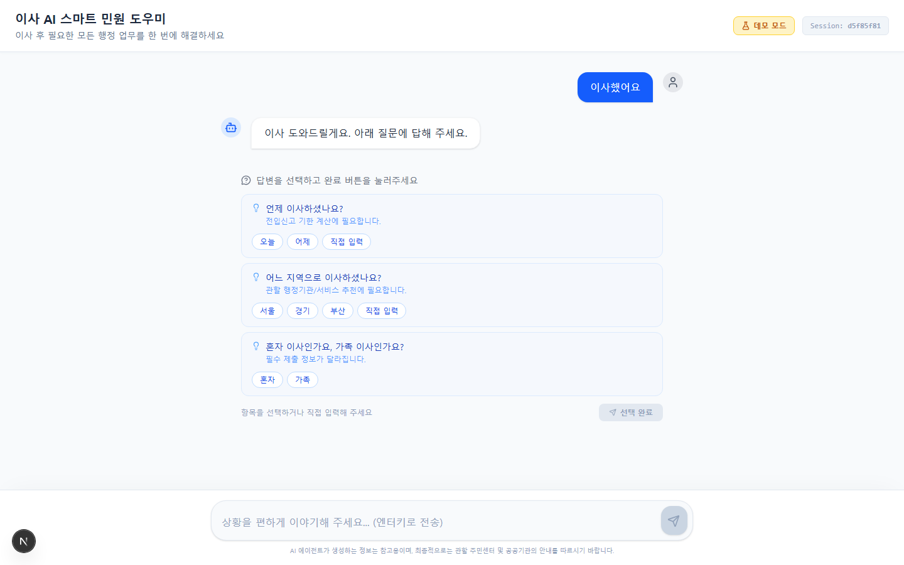
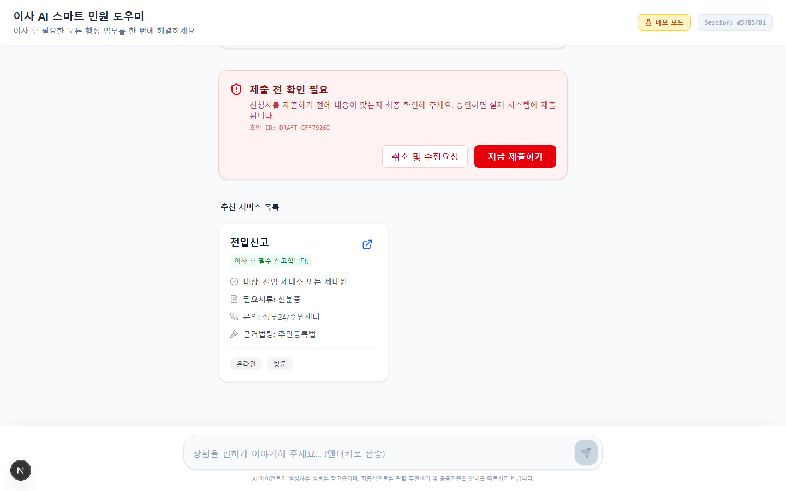

# 이사 AI 민원 오케스트레이터 — UI 검증 보고서

## 기본 정보
- **작성일**: 2026-02-26
- **테스트 환경**: 백엔드 http://localhost:8000 / 프론트 http://localhost:3000 / 브라우저 Chromium

---

## 📸 화면별 섹션

### 1. 초기 화면 (빈 채팅)

- **화면 설명**: 챗봇 인터페이스 초기 접속 화면으로 중앙에 안내 메시지와 예시 질문 버튼이 있습니다.
- **확인된 동작**: 정상
- **특이사항**: 우측 상단에 Session ID가 표기되며, 기본 "실제 모드"로 활성화됩니다.

### 2. 실제 모드: 첫 메시지 전송 (인터뷰 단계)

- **화면 설명**: "어제 강남구에서 판교로 이사했어요. 뭐부터 해야 하죠?" 입력 후 AI가 세부 정보를 묻는 인터뷰 UI 화면입니다.
- **확인된 동작**: 정상
- **특이사항**: 이사 날짜, 지역, 가구원수 등을 파악하는 질문과 선택지 버튼들이 정상적으로 노출됩니다.

### 3. 실제 모드: 추천 결과 화면

- **화면 설명**: 인터뷰 답변 후 AI가 생성한 해야 할 일 목록과 맞춤형 행정 서비스 목록입니다.
- **확인된 동작**: 정상
- **특이사항**: P0/P1/P2 우선순위에 따른 태스크 체크리스트 및 외부 신청 링크가 포함된 서비스 카드가 표시됩니다.

### 4. 전입신고 초안 생성 요청

- **화면 설명**: "전입신고 초안 만들어줘" 요청 후 AI가 입력값을 바탕으로 백그라운드 폼을 채우고 대기하는 화면입니다.
- **확인된 동작**: 정상
- **특이사항**: 붉은색 "제출 전 확인 필요" HITL(비인가 개입) 배너와 Draft ID가 생성되며 사용자의 명시적 승인을 요구합니다.

### 5. HITL 제출 확인 클릭

- **화면 설명**: 사용자가 HITL 배너에서 "지금 제출하기"를 클릭해 확정된 상태입니다.
- **확인된 동작**: 정상
- **특이사항**: 배너가 녹색 완료 상태 상자로 변경되며 제출 상태가 성공적으로 연동됩니다.

### 6. Mock 모드 전환

- **화면 설명**: 페이지를 새로고침한 뒤 상단 토글을 눌러 "데모 모드(목데이터)"로 구동 방식을 변경한 상태입니다.
- **확인된 동작**: 정상
- **특이사항**: UI 라벨이 데모 모드로 전환되며 Session ID가 새롭게 발급됩니다.

### 7. Mock 모드: 첫 메시지

- **화면 설명**: Mock 상태에서 "이사했어요" 메시지를 보내 백엔드 호출 없이 즉각 반환된 UI 결과창입니다.
- **확인된 동작**: 정상
- **특이사항**: 내부 데이터로 하드코딩된 인터뷰, 체크리스트, 건너뛰기 버튼이 1초 내에 지연 없이 나타납니다.

### 8. Mock 모드: 초안 생성

- **화면 설명**: Mock 상태에서 "전입신고 초안 만들어줘"를 입력했을 때 나타나는 가상 HITL 배너 화면입니다.
- **확인된 동작**: 정상
- **특이사항**: Mock용 고정 Draft ID(DRAFT-MOCK1234)가 노출되며 "취소" 및 "제출" UI가 동일하게 제공됩니다.

---

## 📝 종합 의견
- **결론**: **웹 UI 인터페이스가 정상 렌더링되며, 실제 LLM 백엔드 통신 플로우와 기획된 에이전트 인터뷰(옵션 선택) 및 HITL 초안 생성 시스템이 모두 성공적으로 동작함을 확인했습니다.**
